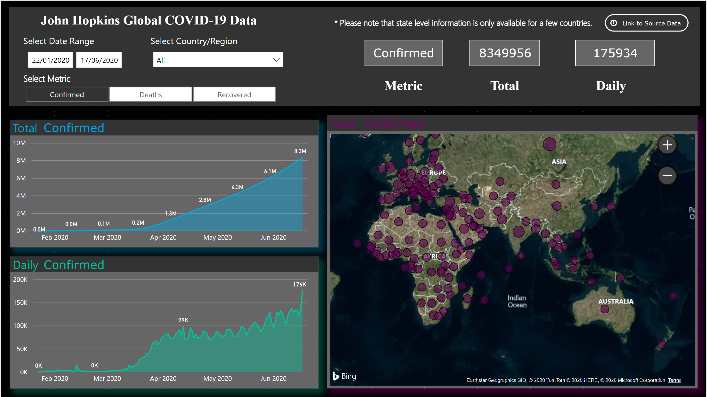
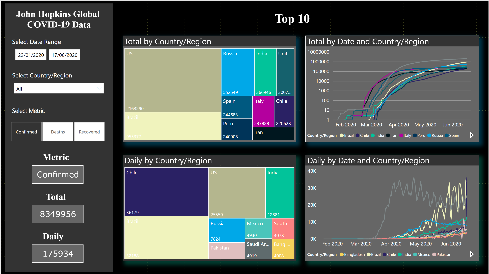
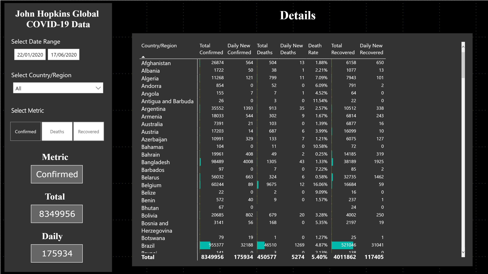

# John Hopkins University Global COVID-19 Data Visualisation using Power BI

This repository contains files for a Power BI report on the coronavirus COVID-19. The
data used in this report is the Global data collected by the Center for Systems Science and Engineering (CSSE) at Johns Hopkins University. This data can be found  [here](https://github.com/CSSEGISandData/COVID-19).

To interact with this report please go over to my ["Dashboards and Reports"](https://dlwhittenbury.github.io/pages/dashboards-and-reports.html) page of my website.
